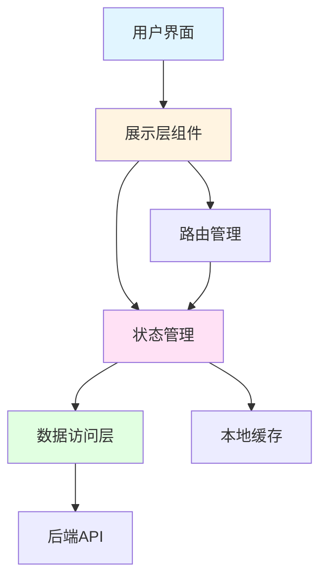

# Design Document: LSO Account Dashboard

## Overview

LSO账户管理系统是一个现代化的Web应用程序，为物流客户提供集中的账户管理界面。系统采用响应式设计，支持桌面、平板和移动设备访问。

设计遵循以下核心原则：
- **信息层次**: 关键指标和操作位于显著位置
- **卡片式布局**: 使用卡片组织相关功能，降低认知负担
- **一致性**: 统一的视觉模式、布局和交互行为
- **响应式**: 适配桌面、平板和移动设备
- **渐进式披露**: 从高层概览开始，按需深入细节

参考资源：
- [Dashboard UI/UX Design Principles](https://allclonescript.com/blog/modern-uiux-design-principles)
- [Mobile Dashboard Best Practices](https://spaceberry.studio/blog/dashboard-ui-four-best-practices-for-mobile-clarity/)
- [Logistics Website Design](https://www.purrweb.com/blog/logistics-website-design/)

## Architecture

系统采用现代前端架构，包含以下层次：

### 1. 展示层 (Presentation Layer)
- **组件**: 可复用的UI组件（按钮、卡片、导航栏等）
- **页面**: 组合组件形成完整页面
- **布局**: 响应式布局容器

### 2. 状态管理层 (State Management Layer)
- **用户状态**: 当前登录用户信息
- **导航状态**: 当前活动标签和路由
- **数据状态**: 包裹、货运、地址等业务数据

### 3. 数据访问层 (Data Access Layer)
- **API客户端**: 与后端服务通信
- **缓存**: 本地数据缓存以提升性能
- **认证**: 处理用户认证和会话管理

### 架构图



## Components and Interfaces

### 1. NavigationBar Component

顶部导航栏组件，提供全局导航和搜索功能。

**Props:**
```typescript
interface NavigationBarProps {
  currentUser: User | null;
  onLogoClick: () => void;
  onMenuItemClick: (menuItem: MenuItem) => void;
  onSearch: (query: string) => void;
  onLanguageChange: (language: string) => void;
}

interface MenuItem {
  id: string;
  label: string;
  href: string;
}
```

**行为:**
- 显示LSO logo（左侧）
- 显示主菜单项：SHIPPING, SERVICES, TRACKING, ABOUT US
- 提供搜索输入框，placeholder为"Track a package"
- 提供语言/地区选择器
- 响应式：移动设备上折叠为汉堡菜单

### 2. WelcomeHeader Component

用户欢迎区域，显示个性化问候和装饰图标。

**Props:**
```typescript
interface WelcomeHeaderProps {
  userName: string;
  illustrationUrl?: string;
}
```

**行为:**
- 显示"MY ACCOUNT"标题
- 显示"HI [NAME],"个性化问候
- 右侧显示装饰性插图
- 响应式：移动设备上插图缩小或隐藏

### 3. TabNavigation Component

标签导航组件，用于在账户不同区域间切换。

**Props:**
```typescript
interface TabNavigationProps {
  tabs: Tab[];
  activeTabId: string;
  onTabChange: (tabId: string) => void;
}

interface Tab {
  id: string;
  label: string;
  content: React.ReactNode;
}
```

**行为:**
- 显示所有标签：Overview, Unshub, Add additional user, Address book, Group maintenance
- 高亮显示当前活动标签
- 点击标签时切换内容区域
- 响应式：移动设备上可能需要横向滚动或下拉选择

### 4. TrackingCard Component

追踪功能卡片，提供快速访问入口。

**Props:**
```typescript
interface TrackingCardProps {
  title: string;
  icon: React.ReactNode;
  onClick: () => void;
}
```

**行为:**
- 显示图标、标题和"Click Here"按钮
- 悬停时显示视觉反馈
- 点击时触发导航或操作
- 响应式：移动设备上垂直堆叠

### 5. ShipmentSection Component

货运管理区域组件。

**Props:**
```typescript
interface ShipmentSectionProps {
  shipments: Shipment[];
  onOptionSelect: (option: string) => void;
}
```

**行为:**
- 显示"Your shipments"标题
- 提供"Your shipment options"下拉菜单
- 显示货运列表或空状态
- 响应式：移动设备上优化列表显示

### 6. AddressBook Component

地址簿管理组件。

**Props:**
```typescript
interface AddressBookProps {
  addresses: Address[];
  onAdd: (address: Address) => void;
  onEdit: (id: string, address: Address) => void;
  onDelete: (id: string) => void;
}
```

**行为:**
- 显示地址列表
- 提供添加、编辑、删除操作
- 验证地址格式
- 防止删除正在使用的地址

### 7. UserManagement Component

用户管理组件。

**Props:**
```typescript
interface UserManagementProps {
  users: AccountUser[];
  onAddUser: (user: NewUserData) => void;
  onRemoveUser: (userId: string) => void;
}
```

**行为:**
- 显示现有用户列表
- 提供添加新用户表单
- 验证邮箱格式
- 发送邀请邮件

## Data Models

### User Model

```typescript
interface User {
  id: string;
  firstName: string;
  lastName: string;
  email: string;
  role: UserRole;
  language: string;
  region: string;
}

enum UserRole {
  ADMIN = 'admin',
  USER = 'user',
  VIEWER = 'viewer'
}
```

### Address Model

```typescript
interface Address {
  id: string;
  label: string;
  recipientName: string;
  addressLine1: string;
  addressLine2?: string;
  city: string;
  state: string;
  postalCode: string;
  country: string;
  phone: string;
  isDefault: boolean;
  inUse: boolean;
}
```

### Shipment Model

```typescript
interface Shipment {
  id: string;
  trackingNumber: string;
  status: ShipmentStatus;
  origin: Address;
  destination: Address;
  createdAt: Date;
  estimatedDelivery: Date;
  actualDelivery?: Date;
}

enum ShipmentStatus {
  PENDING = 'pending',
  IN_TRANSIT = 'in_transit',
  OUT_FOR_DELIVERY = 'out_for_delivery',
  DELIVERED = 'delivered',
  EXCEPTION = 'exception'
}
```

### Package Model

```typescript
interface Package {
  id: string;
  trackingNumber: string;
  status: ShipmentStatus;
  weight: number;
  dimensions: Dimensions;
  currentLocation?: string;
  events: TrackingEvent[];
}

interface Dimensions {
  length: number;
  width: number;
  height: number;
  unit: 'cm' | 'in';
}

interface TrackingEvent {
  timestamp: Date;
  location: string;
  status: string;
  description: string;
}
```

### AccountUser Model

```typescript
interface AccountUser {
  id: string;
  email: string;
  firstName: string;
  lastName: string;
  role: UserRole;
  status: UserStatus;
  invitedAt: Date;
  lastLogin?: Date;
}

enum UserStatus {
  INVITED = 'invited',
  ACTIVE = 'active',
  INACTIVE = 'inactive'
}
```

### NewUserData Model

```typescript
interface NewUserData {
  email: string;
  firstName: string;
  lastName: string;
  role: UserRole;
}
```

## Responsive Design Strategy

系统采用移动优先的响应式设计策略：

### 断点定义

```css
/* Mobile: < 768px */
/* Tablet: 768px - 1024px */
/* Desktop: > 1024px */
```

### 布局适配

**Mobile (< 768px):**
- 导航栏折叠为汉堡菜单
- 追踪卡片垂直堆叠
- 标签导航可横向滚动
- 单列布局

**Tablet (768px - 1024px):**
- 导航栏显示主要菜单项
- 追踪卡片2列布局
- 标签导航完整显示
- 双列布局

**Desktop (> 1024px):**
- 完整导航栏
- 追踪卡片3列布局
- 宽松的间距和边距
- 多列布局

### CSS Grid 实现

```css
.tracking-cards-container {
  display: grid;
  gap: 1.5rem;
  
  /* Mobile: 1 column */
  grid-template-columns: 1fr;
  
  /* Tablet: 2 columns */
  @media (min-width: 768px) {
    grid-template-columns: repeat(2, 1fr);
  }
  
  /* Desktop: 3 columns */
  @media (min-width: 1024px) {
    grid-template-columns: repeat(3, 1fr);
  }
}
```

参考: [Responsive Dashboard with CSS](https://reintech.io/blog/creating-responsive-dashboard-with-css)


## Correctness Properties

属性是系统在所有有效执行中应保持为真的特征或行为——本质上是关于系统应该做什么的形式化陈述。属性作为人类可读规范和机器可验证正确性保证之间的桥梁。

### Property Reflection

在编写属性之前，我识别了以下可以合并或简化的冗余属性：

**合并的属性:**
- 需求4.4-4.6（三个卡片的点击导航）可以合并为一个属性：所有追踪卡片的点击行为
- 需求4.7-4.9（三个卡片的图标）是具体示例，不需要单独的属性
- 需求8.3-8.5（添加、编辑、删除地址）可以合并为CRUD操作属性

**边缘情况处理:**
- 需求6.1-6.3（响应式断点）作为边缘情况在生成器中处理
- 需求5.5（空状态）作为边缘情况测试

### Navigation Properties

**Property 1: Navigation bar presence**
*For any* page in the system, the navigation bar component should be present in the DOM
**Validates: Requirements 1.1**

**Property 2: Required menu items presence**
*For any* navigation bar render, all required menu items (SHIPPING, SERVICES, TRACKING, ABOUT US) should be present
**Validates: Requirements 1.3**

**Property 3: Menu navigation behavior**
*For any* menu item click, the system should navigate to the corresponding URL or section
**Validates: Requirements 1.6**

### User Authentication Properties

**Property 4: Personalized greeting format**
*For any* authenticated user with a first name, the welcome header should display "HI [FIRSTNAME]," in uppercase
**Validates: Requirements 2.2**

**Property 5: Unauthenticated redirect**
*For any* unauthenticated user attempting to access the dashboard, the system should redirect to the login page
**Validates: Requirements 2.4**

### Tab Navigation Properties

**Property 6: Required tabs presence**
*For any* dashboard render, all required tabs (Overview, Unshub, Add additional user, Address book, Group maintenance) should be present
**Validates: Requirements 3.2**

**Property 7: Tab content switching**
*For any* tab click, the system should display the content area corresponding to that tab
**Validates: Requirements 3.3**

**Property 8: Active tab indication**
*For any* active tab, the system should apply a visual indicator (CSS class or style) to distinguish it from inactive tabs
**Validates: Requirements 3.4**

**Property 9: Tab state persistence**
*For any* tab selection, navigating within the account section and returning should preserve the selected tab
**Validates: Requirements 3.5**

### Tracking Cards Properties

**Property 10: Tracking cards presence**
*For any* Overview tab render, all three tracking cards (Track a Package, Reports, Proof of Delivery) should be present
**Validates: Requirements 4.2**

**Property 11: Tracking card structure**
*For any* tracking card, it should contain an icon element, a title element, and a "Click Here" button
**Validates: Requirements 4.3**

**Property 12: Tracking card navigation**
*For any* tracking card click, the system should navigate to the corresponding interface (package tracking, reports, or delivery proof)
**Validates: Requirements 4.4, 4.5, 4.6**

### Shipment Management Properties

**Property 13: Dropdown interaction**
*For any* closed dropdown menu, clicking it should reveal the available options
**Validates: Requirements 5.3**

**Property 14: Shipment display**
*For any* non-empty shipment list, all shipments should be rendered in the designated area
**Validates: Requirements 5.4**

### Responsive Design Properties

**Property 15: Touch target sizing**
*For any* interactive element on mobile viewport (< 768px), the touch target size should be at least 44x44 pixels
**Validates: Requirements 6.4**

### Design Consistency Properties

**Property 16: Button style consistency**
*For any* two buttons in the system, they should share the same base CSS classes for consistent styling
**Validates: Requirements 7.2**

**Property 17: Icon style consistency**
*For any* icon element, it should use the same icon library and size classes
**Validates: Requirements 7.3**

**Property 18: Brand color usage**
*For any* UI element with color styling, the color value should be from the approved LSO brand palette
**Validates: Requirements 7.5**

### Address Book Properties

**Property 19: Address list display**
*For any* set of saved addresses, all addresses should be rendered in the address book list
**Validates: Requirements 8.2**

**Property 20: Address CRUD operations**
*For any* valid address data, the system should support add, edit, and delete operations
**Validates: Requirements 8.3, 8.4, 8.5**

**Property 21: In-use address protection**
*For any* address that is referenced by active shipments, deletion attempts should be prevented and a warning should be displayed
**Validates: Requirements 8.6**

### User Management Properties

**Property 22: Invitation email sending**
*For any* newly added user with valid email, the system should trigger an invitation email
**Validates: Requirements 9.3**

**Property 23: Email validation**
*For any* email input in the user management form, the system should validate the format before accepting
**Validates: Requirements 9.4**

**Property 24: User list display**
*For any* set of account users, all users should be displayed with their role and status information
**Validates: Requirements 9.5**

### Search Properties

**Property 25: Valid tracking number search**
*For any* valid LSO tracking number entered in the search, pressing Enter should navigate to the tracking results page
**Validates: Requirements 10.2**

**Property 26: Invalid tracking number handling**
*For any* invalid tracking number format, the system should display an error message instead of navigating
**Validates: Requirements 10.3**

**Property 27: Tracking format support**
*For any* tracking number matching LSO's format patterns, the system should accept it as valid
**Validates: Requirements 10.4**

**Property 28: Search suggestions**
*For any* partial tracking number input, the system should display relevant search suggestions
**Validates: Requirements 10.5**

## Error Handling

系统应优雅地处理各种错误情况：

### 1. 网络错误
- **超时**: 显示友好的超时消息，提供重试选项
- **连接失败**: 显示离线状态，缓存用户操作以便恢复连接后重试
- **服务器错误**: 显示通用错误消息，记录详细错误供调试

### 2. 验证错误
- **邮箱格式**: 实时验证，显示内联错误消息
- **必填字段**: 提交前验证，高亮显示缺失字段
- **追踪号格式**: 搜索时验证，显示格式要求

### 3. 业务逻辑错误
- **删除使用中的地址**: 阻止操作，显示警告消息说明原因
- **重复邮箱**: 添加用户时检查，显示冲突提示
- **权限不足**: 隐藏或禁用用户无权访问的功能

### 4. 边缘情况
- **空状态**: 显示有意义的空状态消息和引导操作
- **加载状态**: 显示加载指示器，避免界面闪烁
- **长列表**: 实现分页或虚拟滚动，保持性能

### 错误消息原则
- 使用清晰、非技术性的语言
- 提供具体的解决建议
- 避免暴露系统内部细节
- 保持品牌语调的一致性

## Testing Strategy

系统采用双重测试策略，结合单元测试和基于属性的测试，以确保全面覆盖。

### 单元测试 (Unit Tests)

单元测试专注于具体示例、边缘情况和错误条件：

**组件渲染测试:**
- NavigationBar显示LSO logo（需求1.2）
- NavigationBar包含语言选择器（需求1.4）
- NavigationBar包含搜索输入框，placeholder为"Track a package"（需求1.5）
- WelcomeHeader显示"MY ACCOUNT"标题（需求2.1）
- WelcomeHeader显示装饰插图（需求2.3）
- TabNavigation显示在欢迎区域下方（需求3.1）
- Overview标签显示"Your Tracking"区域（需求4.1）
- 追踪卡片显示正确的图标（需求4.7-4.9）
- Overview标签显示"Your shipments"区域（需求5.1）
- ShipmentSection包含"Your shipment options"下拉菜单（需求5.2）

**交互测试:**
- 点击logo导航到首页（需求1.7）
- 点击Track a Package卡片导航到追踪界面（需求4.4）
- 点击Reports卡片导航到报告界面（需求4.5）
- 点击Proof of Delivery卡片导航到交付证明界面（需求4.6）
- 点击Address book标签显示地址簿界面（需求8.1）
- 点击Add additional user标签显示用户管理界面（需求9.1）
- 搜索栏存在于导航栏中（需求10.1）

**边缘情况测试:**
- 无货运时显示空状态消息（需求5.5）
- 移动视口（< 768px）显示移动布局（需求6.1）
- 平板视口（768-1024px）显示平板布局（需求6.2）
- 桌面视口（> 1024px）显示桌面布局（需求6.3）

**表单测试:**
- 用户管理表单接受姓名、邮箱、角色（需求9.2）

### 基于属性的测试 (Property-Based Tests)

基于属性的测试验证跨所有输入的通用属性。每个测试应运行至少100次迭代。

**测试库选择:**
- **JavaScript/TypeScript**: 使用 [fast-check](https://github.com/dubzzz/fast-check)
- **React组件**: 结合 @testing-library/react 和 fast-check

**属性测试配置:**
```typescript
// 每个属性测试至少100次迭代
fc.assert(
  fc.property(/* generators */, (/* inputs */) => {
    // 测试逻辑
  }),
  { numRuns: 100 }
);
```

**属性测试列表:**

每个测试必须使用注释标记引用设计文档属性：

```typescript
// Feature: lso-account-dashboard, Property 1: Navigation bar presence
test('navigation bar appears on all pages', () => {
  fc.assert(
    fc.property(pageGenerator(), (page) => {
      const { container } = render(<App currentPage={page} />);
      expect(container.querySelector('[data-testid="navigation-bar"]')).toBeInTheDocument();
    }),
    { numRuns: 100 }
  );
});

// Feature: lso-account-dashboard, Property 2: Required menu items presence
test('all required menu items are present', () => {
  fc.assert(
    fc.property(navigationStateGenerator(), (state) => {
      const { container } = render(<NavigationBar {...state} />);
      const requiredItems = ['SHIPPING', 'SERVICES', 'TRACKING', 'ABOUT US'];
      requiredItems.forEach(item => {
        expect(container).toHaveTextContent(item);
      });
    }),
    { numRuns: 100 }
  );
});

// Feature: lso-account-dashboard, Property 4: Personalized greeting format
test('greeting displays correct format for any user', () => {
  fc.assert(
    fc.property(userGenerator(), (user) => {
      const { container } = render(<WelcomeHeader userName={user.firstName} />);
      const expectedGreeting = `HI ${user.firstName.toUpperCase()},`;
      expect(container).toHaveTextContent(expectedGreeting);
    }),
    { numRuns: 100 }
  );
});

// Feature: lso-account-dashboard, Property 10: Tracking cards presence
test('all three tracking cards are present', () => {
  fc.assert(
    fc.property(overviewStateGenerator(), (state) => {
      const { container } = render(<OverviewTab {...state} />);
      expect(container.querySelectorAll('[data-testid="tracking-card"]')).toHaveLength(3);
    }),
    { numRuns: 100 }
  );
});

// Feature: lso-account-dashboard, Property 19: Address list display
test('all addresses are displayed in address book', () => {
  fc.assert(
    fc.property(addressListGenerator(), (addresses) => {
      const { container } = render(<AddressBook addresses={addresses} />);
      addresses.forEach(address => {
        expect(container).toHaveTextContent(address.label);
      });
    }),
    { numRuns: 100 }
  );
});

// Feature: lso-account-dashboard, Property 21: In-use address protection
test('cannot delete addresses in use by active shipments', () => {
  fc.assert(
    fc.property(addressWithShipmentsGenerator(), (address) => {
      const onDelete = jest.fn();
      const { getByTestId } = render(
        <AddressBook addresses={[address]} onDelete={onDelete} />
      );
      
      fireEvent.click(getByTestId(`delete-address-${address.id}`));
      
      expect(onDelete).not.toHaveBeenCalled();
      expect(screen.getByText(/in use/i)).toBeInTheDocument();
    }),
    { numRuns: 100 }
  );
});

// Feature: lso-account-dashboard, Property 23: Email validation
test('email validation rejects invalid formats', () => {
  fc.assert(
    fc.property(invalidEmailGenerator(), (email) => {
      const { getByLabelText, getByText } = render(<UserManagement />);
      const emailInput = getByLabelText(/email/i);
      
      fireEvent.change(emailInput, { target: { value: email } });
      fireEvent.blur(emailInput);
      
      expect(getByText(/invalid email/i)).toBeInTheDocument();
    }),
    { numRuns: 100 }
  );
});

// Feature: lso-account-dashboard, Property 26: Invalid tracking number handling
test('invalid tracking numbers show error message', () => {
  fc.assert(
    fc.property(invalidTrackingNumberGenerator(), (trackingNumber) => {
      const { getByPlaceholderText, getByText } = render(<NavigationBar />);
      const searchInput = getByPlaceholderText(/track a package/i);
      
      fireEvent.change(searchInput, { target: { value: trackingNumber } });
      fireEvent.keyPress(searchInput, { key: 'Enter', code: 'Enter' });
      
      expect(getByText(/invalid tracking number/i)).toBeInTheDocument();
    }),
    { numRuns: 100 }
  );
});
```

**生成器示例:**

```typescript
// 用户生成器
const userGenerator = () => fc.record({
  id: fc.uuid(),
  firstName: fc.string({ minLength: 1, maxLength: 50 }),
  lastName: fc.string({ minLength: 1, maxLength: 50 }),
  email: fc.emailAddress(),
  role: fc.constantFrom('admin', 'user', 'viewer'),
  language: fc.constantFrom('en', 'zh', 'es'),
  region: fc.constantFrom('US', 'CN', 'EU')
});

// 地址生成器
const addressGenerator = () => fc.record({
  id: fc.uuid(),
  label: fc.string({ minLength: 1, maxLength: 50 }),
  recipientName: fc.string({ minLength: 1, maxLength: 100 }),
  addressLine1: fc.string({ minLength: 1, maxLength: 100 }),
  city: fc.string({ minLength: 1, maxLength: 50 }),
  state: fc.string({ minLength: 2, maxLength: 2 }),
  postalCode: fc.string({ minLength: 5, maxLength: 10 }),
  country: fc.constantFrom('US', 'CN', 'CA', 'UK'),
  phone: fc.string({ minLength: 10, maxLength: 15 }),
  isDefault: fc.boolean(),
  inUse: fc.boolean()
});

// 无效邮箱生成器
const invalidEmailGenerator = () => fc.oneof(
  fc.string().filter(s => !s.includes('@')),
  fc.string().map(s => s + '@'),
  fc.string().map(s => '@' + s),
  fc.constant('invalid..email@test.com'),
  fc.constant('invalid@'),
  fc.constant('@invalid.com')
);

// 无效追踪号生成器
const invalidTrackingNumberGenerator = () => fc.oneof(
  fc.string({ maxLength: 5 }), // 太短
  fc.string({ minLength: 50 }), // 太长
  fc.constant(''), // 空字符串
  fc.string().filter(s => /[^A-Z0-9]/.test(s)) // 包含无效字符
);
```

### 测试覆盖目标

- **单元测试**: 覆盖所有组件的基本渲染和交互
- **属性测试**: 覆盖所有28个正确性属性
- **集成测试**: 覆盖关键用户流程（登录→查看仪表板→追踪包裹）
- **端到端测试**: 覆盖完整的用户场景

### 持续集成

- 所有测试在每次提交时运行
- 属性测试失败时，保存失败的输入用例
- 代码覆盖率目标：80%以上
- 性能测试：页面加载时间 < 2秒
